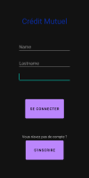
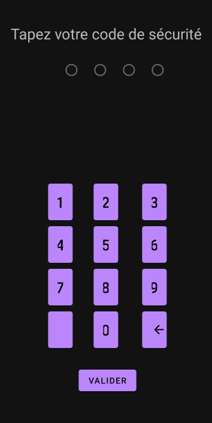
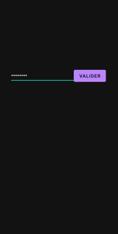
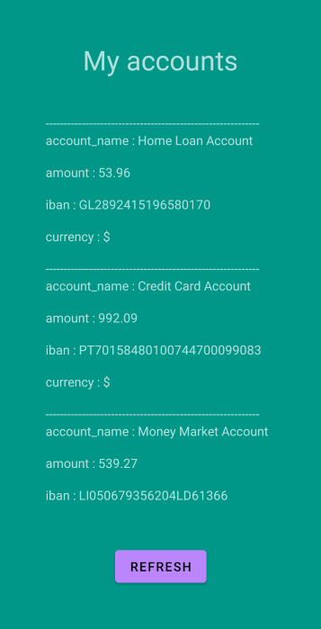

# ADSA
Application Development Security Android

__TODO__ : 
 - LogIn page
 - Accounts
 - Sign Up page 
 - Use API : Recover information (name(=endpoint n1), accounts and values(=endpoint n2)) securely with _TLS_

__IMPORTANT__ :
 - App available offline
 - Access is restricted. User must be authenticated  
 - It must be impossible to recover API url, data and debugging information

__Requirements__

This application must be available offline. ✓
A refresh button allows the user to update its accounts. ✓
Access to the application is restricted ✓
Exchanges with API must be secure ( with _TLS_) ✓

## Explain how you ensure user is the right one starting the app

Lorsque que l'utilisateur entre pour la première fois dans l'application, il lui est demandé d'entrer ses credentials : 
    - name
    - lastname
    - password (inutile car le backend de l'API n'implémente pas de vérification)
    
Puis un Pin de 4 chiffres lui est demandé. Ce dernier lui sera demandé à chaque overture de l'application.
Ainsi nous sommes sûr que seul l'utilisateur peut regarder ses comptes.    

## How do you securely save user's data on your phone ?

Nous sauvegardons les données de l'utilisateur dans une base de donnée locale à l'aide de la librairie _SQLiteCipher_. Celle-ci est chiffrée à l'aide du pin de l'utilisateur.
Ainsi si un attaquant réussi à obtenir par, un quelconque moyen, la base de données, il sera obligé de procéder à une attaque par force brute afin de lire son contenu.

Pour plus de sécurité, l'utilisateur a 3 essais lors de la saisie de son code pin. Dans le cas ou il échouerait à 3 reprises, la base de donnée est supprimée et l'utilisaeur devra se reconnecter en online.

EDIT : La technique du code pin se révélait trop faible : quand bien même la base données serait supprimée au bout de 3 tentatives, l'attaquant pourrait simplement extraire cette dernière et avoir un nombre de tentatives illimitées. Comme le code pin servait à déverouiller la base de données et que son nombre de valeurs possibles était bien trop petit (10 000 car 4 chiffres), l'attaquant aurait facilement pu la craquer par force brute. Nous avons donc remplacé le code pin par un mot de passe (caractères et chiffres) avec une longueur minimale de 8.

## How did you hide the API url ?

Pour cacher le lien de l'API, nous avons procédé en concaténant l'url et en le remplaçant par une additon de variables. Par exemple, nous avons notre url sous la forme de la forme : <<var URL:String = a+b+c >>équivalent à <<var URL:String = "https://" >> où a="htt", b="ps:" et c="//" .
Nous avons procédé ainsi pour la totalité de l'URL et pour que les variables soient beaucoup plus difficiles à repérer pour un attaquant, nous avons crée un grand nombre de fichiers kotlin et nous avons séparé nos variables dans 4 fichiers sur la totalité et les autres contenaient des variables inutilisés prévenant ainsi d'un trop grand écart d'octets par fichiers.
Cette méthode n'est pas parfaite car un attaquant pourra toujours retrouver l'URL mais cependant il aura besoin de beaucoup plus de temps et d'énergie pour car le grand nombre de variables et de fichiers de nom similaire compliquent grandement le travail

## Screenshots of your application

